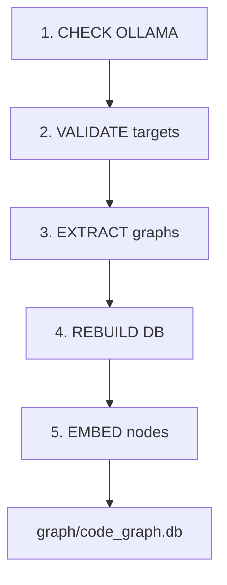

# Database Pipeline

The database pipeline extends the graph extractor with a SQLite database and vector embeddings, creating a queryable code knowledge base.

## Flow

```bash
bindwood scan
```



### 1. Check Ollama

Is Ollama running? Is the configured embedding model available?

- If the model is missing → auto-pull.
- If Ollama is unreachable → skip embeddings, continue with the structural graph.

### 2. Validate

Load targets from config. Verify that root directories / DDL files exist. Skip targets with missing paths.

### 3. Extract

For each target, run tree-sitter (JS/TS/Python) or sqlglot (DDL). Produce a graph JSON with `source_text` captured per node. JSON files are still written to `graph/` for inspection.

### 4. Rebuild database

Delete the existing DB. Create a fresh SQLite with the schema. Load all graphs: normalize DDL into nodes/edges format, insert JS/TS nodes/edges directly.

!!! info "Every run is a full refresh"
    The database is recreated from scratch on every `bindwood scan`. This keeps the pipeline simple and the data always consistent with the current state of the source code.

### 5. Embed

For every node with `source_text`, generate a 768-dim vector via Ollama and store it in the `sqlite-vec` virtual table.

### Output

A single file: **`graph/code_graph.db`**. Zero infrastructure.

---

## Configuration

In `config.json`:

```json
{
  "database": {
    "path": "graph/code_graph.db"
  }
}
```

The path can be relative (to workspace root) or absolute.

## CLI flags

```bash
bindwood scan                     # full pipeline (extract + DB + embeddings)
bindwood scan --no-embeddings     # skip embedding generation
bindwood scan --target my-app     # only process specific target(s)
```

Full CLI reference: [CLI → Query Reference](../cli/query.md).
