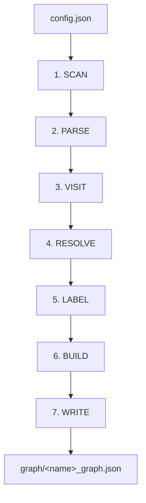

# Extractor Pipeline

The JS/TS extractor processes files through seven stages. Understanding the pipeline helps you read the output, tune the config, and debug edge cases.

## Pipeline stages

### 1. Scan

`discover_files()` walks the project root, applying `include` / `exclude` globs and `max_depth`.

### 2. Parse

Tree-sitter parses each file; the grammar is selected by extension:

| Extension | Grammar |
|-----------|---------|
| `.js`, `.jsx`, `.mjs`, `.cjs` | JavaScript |
| `.ts`, `.mts` | TypeScript |
| `.tsx` | TSX |
| `.py` | Python |

### 3. Visit

Enabled visitors run against each file's AST, producing typed records:

| Visitor | Output |
|---------|--------|
| `imports` | `ImportInfo[]` — ESM + CJS |
| `exports` | `ExportInfo[]` — ESM + CJS |
| `functions` | `FunctionInfo[]` — declarations, arrows, methods |
| `calls` | `CallInfo[]` — every call expression |
| `classes` | `ClassInfo[]` — with methods and properties |
| `types` | `TypeInfo[]` — interfaces, type aliases, enums |

### 4. Resolve

`ImportResolver` maps each specifier to a project-relative file path:

1. Relative paths (`./foo`, `../bar`)
2. Manual aliases (`resolve.alias`)
3. `tsconfig` paths
4. `tsconfig` baseUrl
5. External → `null` (when `skip_external: true`)

Full rules: [Alias Resolution](alias-resolution.md).

### 5. Label

`apply_labels()` walks each call's callee chain, matches against every label pattern with `fnmatch`, and decorates the call with `labels[]` and optionally `captured_arg`.

Full rules: [Label Patterns](label-patterns.md).

### 6. Build

`graph_builder` assembles every `FileResult` into one `{ metadata, nodes[], edges[] }` JSON graph.

### 7. Write

The graph is written to the configured `.json` file (defaults to `graph/<name>_graph.json`).

## Error handling

- Files with syntax errors still produce partial ASTs — extraction continues with best-effort results.
- Errors are collected and reported at the end (first 10 shown).
- Unresolved imports appear as edges with `to: null` rather than failing.

## DDL and Python pipelines

The **DDL** extractor uses `sqlglot` instead of tree-sitter, but follows the same 1/parse → 3/visit → 6/build → 7/write shape. There is no resolve or label phase.

The **Python** extractor mirrors the JS/TS pipeline, with its own visitors for `def`, `class`, `import`, and call expressions. Label rules apply identically.
