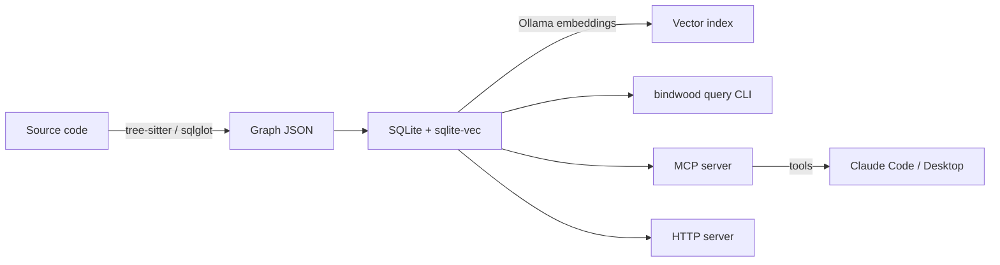

# bindwood

**Tree-sitter-based static analysis that turns a codebase into a queryable graph + vector index — exposed to LLMs via MCP.**

bindwood parses source files into ASTs and produces a graph of **nodes** (files, functions, classes, calls, exports, types, tables, views) and **edges** (imports, contains, exports, extends, FK relationships) that represent the architecture of a project. The graph is enriched with **source code text** for each node and **vector embeddings** (via Ollama) for semantic similarity search.

The result is a single `.db` file that an LLM can query through an MCP server to navigate codebases efficiently — structural graph traversal for *"where is it?"* and vector search for *"what does it do?"* — reducing token consumption by replacing blind file exploration with targeted O(1) lookups.

---

## Why bindwood

!!! tip "The core idea"
    Stop forcing LLMs to read entire directories. Give them a **graph** to traverse and a **vector index** to search. They call a handful of MCP tools and arrive at the exact file/function/table they need.

| Traditional approach | With bindwood |
|----------------------|---------------|
| Grep + read whole files (O(n) tokens) | Vector search → O(1) semantic lookup |
| Manually trace import chains | `get_neighbors` → structural graph walk |
| Guess at naming conventions | `find_nodes` by type, label, file pattern |
| Re-read code across turns | Single `.db` file, persistent between sessions |

---

## What it extracts

- **JavaScript / TypeScript** — files, functions, classes, call expressions, exports, interfaces, type aliases, enums
- **Python** — modules, functions, classes, call expressions, imports
- **SQL DDL** — tables, columns, primary keys, foreign keys, indexes, views, materialized views, enums

Every extracted node carries its **source text** and a **vector embedding**, making both structural and semantic queries first-class.

---

## How it fits together

---

## Next steps

-   :material-rocket-launch: **[Get started](getting-started/installation.md)**

    Install bindwood and run your first scan.

-   :material-cog: **[Configuration](configuration/index.md)**

    Define extraction targets for DDL, JS/TS, Python.

-   :material-graph: **[Extractors](extractors/pipeline.md)**

    How parsing, visiting, resolving, and labeling work.

-   :material-database: **[Database & embeddings](database/pipeline.md)**

    SQLite schema, vector index, Ollama integration.

-   :material-console: **[Query CLI](cli/query.md)**

    `bindwood query` — semantic search, graph traversal, raw SQL.

-   :material-robot: **[MCP server](mcp/setup.md)**

    Expose the graph as tools Claude can call directly.

-   :material-chart-scatter-plot: **[Visualization](viz/index.md)**

    Browser UI for humans — project graph, skeleton treemap, label heatmap.

