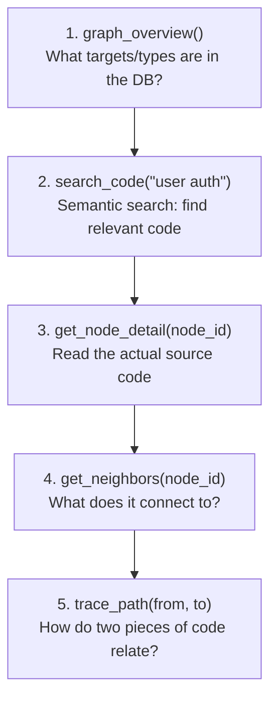

# Claude Workflow

The recommended workflow for Claude when answering code questions against a bindwood graph.



## What this replaces

The traditional pattern:

- Reading entire directories to find relevant files — **O(n) tokens**
- Grepping for keywords that may not match semantic intent
- Manually tracing import chains across many file reads

Becomes:

- **Vector search** for semantic relevance — O(1) lookup
- **Graph traversal** for structural context — targeted reads
- **Reading only** the source code that actually matters

## Example session

> *"Where does the app enforce that only admins can delete orders?"*

```
1. search_code("admin authorization delete order")
     → returns auth guard + relevant handlers + middleware
2. get_node_detail("func::...::adminGuard")
     → read the guard implementation
3. get_neighbors(<order delete handler>, direction="in")
     → confirm which routes call the guarded handler
4. find_nodes(type="call", label="auth_check", file="orders/%")
     → enumerate every auth_check in the orders module
```

Five tool calls, a handful of nodes inspected, zero blind file reads.

## Tips

- **Always call `graph_overview` first** in a new conversation. It tells Claude which targets exist and what types are populated.
- **Use `search_code` for discovery, `find_nodes` for enumeration.** Search is fuzzy and ranked; find is precise and exhaustive.
- **Partial IDs are your friend.** `get_node_detail("User.login")` is much shorter than passing the full `func::…` ID.
- **`trace_path` with `max_depth=3` is usually enough.** Deeper searches get noisy quickly; fall back to `get_neighbors` for stepwise exploration.
